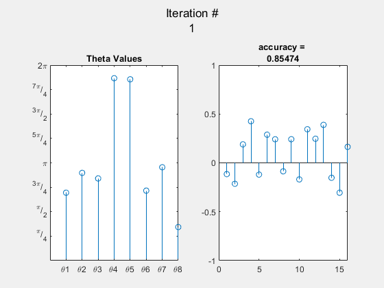
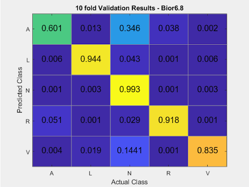
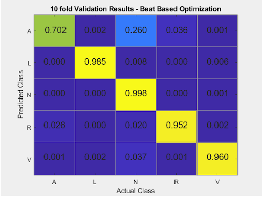
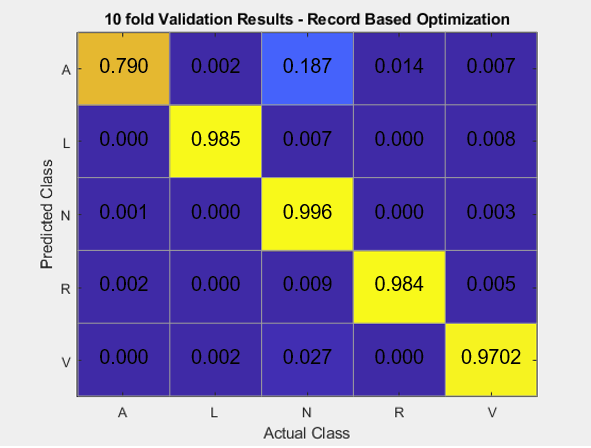

[![Contributors][contributors-shield]][contributors-url]
[![LinkedIn][linkedin-shield]][linkedin-url]


<!-- PROJECT LOGO -->
<br />
<p align="center">
  <a href="https://github.com/Karndeep-UCSD/Wavelet-Optimization-for-Time-Series-Classification">
    
  </a>

  <h3 align="center">Wavelet Optimization for Time Series Classification</h3>

  <p align="center">
    Robust real-time classification of electrocardiograms relies upon effective feature extraction and reduction. 
     This work utilizes wavelet multi-resolution analysis(WMRA) in conjunction with principal component analysis(PCA) 
    to generate high quality, low-dimesional feature vectors. These vectors are classified as one of six types of heart 
    beats using a multiclass Support Vector Machine(SVM) classifier. Application specific mother wavelets were determined
    via Particle Swarm Optimization(PSO).
    <br />
  </p>
</p>


<!-- TABLE OF CONTENTS -->
<details open="open">
  <summary><h2 style="display: inline-block">Table of Contents</h2></summary>
  <ol>
    <li>
      <a href="#about-the-project">About The Project</a>
    </li>
    <li><a href="#prerequisites">Prerequisites</a></li>
    <li><a href="#usage">Usage</a></li>
    <li><a href="#contact">Contact</a></li>
  </ol>
</details>


<!-- ABOUT THE PROJECT -->
## About The Project


<!-- Prerequisites -->
## Prerequisites
This repository uses function from the following Matlab toolboxes.
* Signal Processing toolbox
* Statistics and Machine Learning toolbox
* Optimization toolbox
* Global Optimization toolbox


<!-- USAGE EXAMPLES -->
## Usage

1. Loading Data
   ```sh
   dataLoader2CSV.m
   ```
   Converts raw ECG data provided by MIT-BIH Arrhythmia Database to annotated and segmented CSV files.
   Processed and prepared data can be found in the folder Raw_Beat_CSV
   
2. Optimization
   ```sh
   Optimization_BeatBased.m
   Optimization_RecordBased.m
   ```
<br />
<p align="center">
    
  </a>
   
   
   
3. Testing
   ```sh
   Test_OverallPerformance.m
   Test_PatientSpecific.m
   ```
<br />
<p align="center">
    
    
    
  </a>

<!-- CONTACT -->
## Contact

Karndeep Singh Rai-Bhatti - [Linkedin]( https://linkedin.com/in/karndeep-raibhatti) - karndeep.raibhatti@gmail.com

Project Link: [https://github.com/Karndeep-UCSD/Wavelet-Optimization-for-Time-Series-Classification](https://github.com/Karndeep-UCSD/Wavelet-Optimization-for-Time-Series-Classification)


<!-- MARKDOWN LINKS & IMAGES -->
[contributors-shield]: https://img.shields.io/github/contributors/github_username/repo.svg?style=for-the-badge
[contributors-url]: https://github.com/github_username/repo/graphs/contributors
[linkedin-shield]: https://img.shields.io/badge/-LinkedIn-black.svg?style=for-the-badge&logo=linkedin&colorB=555
[linkedin-url]: https://linkedin.com/in/karndeep-raibhatti
