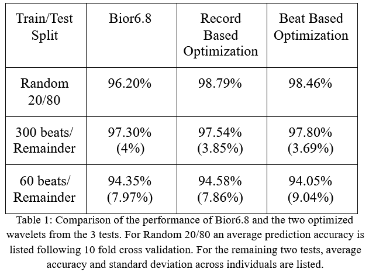

[![Contributors][contributors-shield]][contributors-url]
[![LinkedIn][linkedin-shield]][linkedin-url]


<!-- PROJECT LOGO -->
<br />
<p align="center">
  <a href="https://github.com/Karndeep-UCSD/Wavelet-Optimization-for-Time-Series-Classification">
    
  </a>

  <h3 align="center">Wavelet Optimization for Time Series Classification</h3>

  <p align="center">
    Robust real-time classification of electrocardiograms relies upon effective feature extraction and reduction. This work utilizes wavelet multi-resolution analysis(WMRA) in conjunction with principal component analysis(PCA) to generate high quality, low-dimesional feature vectors. These vectors are classified as one of six types of heart beats using a multiclass Support Vector Machine(SVM) classifier. Application specific mother wavelets were determined via Particle Swarm Optimization(PSO).
    <br />
  </p>
</p>


<!-- TABLE OF CONTENTS -->
<details open="open">
  <summary><h2 style="display: inline-block">Table of Contents</h2></summary>
  <ol>
    <li>
      <a href="#about-the-project">About The Project</a>
    </li>
    <li><a href="#prerequisites">Prerequisites</a></li>
    <li><a href="#usage">Usage</a></li>
    <li><a href="#contact">Contact</a></li>
  </ol>
</details>


<!-- ABOUT THE PROJECT -->
## About The Project
<p>
This work was conducted with the goal of defining a new approach to extract low dimensional features from time series ECG data for use in classification. Wavelet multi-resolution analysis is often utilized to extract a feature set from time-series data. Rather than selecting a predefined wavelet, a custom wavelet is found via particle swarm optimization. Once selected, wavelet features undergo dimensional reduction by principal component analysis before being used to train a one-vs-one support vector machine classifier. 
</p>
<p>
Two optimization schemes were implemented, record based and beat based, resulting in two different optimized wavelets. Both wavelets were evaluated with 10-fold cross validation, using a train-test split of 20/80 selected at random, as well as a patient specific scheme where only initial data, 300 beats or 60 beats, was used for training. The wavelet optimized from the record based scheme achieved <b> 98.79%, 97.54%, and 94.58% classification accuracy,</b> respectively on the three evaluation scenarios. The wavelet optimized from the beat based scheme achieved <b>98.46%. 97.80%, and 94.05%,</b> respectively on the three evaluation scenarios. 
</p>
  
<p align="center">
  
  
</p>

The first flow chart summaries the ECG classification framework propsed by Liu et al. that this work utilizes. 
The second chart outlines the implimented optimization scheme. Particle swarm optimization was used to minimize the classification error of the SVM. A global minimum was achieved by tuning the parameters of the wavelet used in the feature transformation.


<!-- Prerequisites -->
## Prerequisites
This repository uses function from the following Matlab toolboxes.
* Signal Processing toolbox
* Statistics and Machine Learning toolbox
* Optimization toolbox
* Global Optimization toolbox
* WFDB toolbox


<!-- USAGE EXAMPLES -->
## Usage and Results

1. Loading Data
   ```sh
   dataLoader2CSV.m
   ```
   Converts raw ECG data provided by MIT-BIH Arrhythmia Database to annotated and segmented CSV files.
   Processed and prepared data can be found in the folder Raw_Beat_CSV
   
2. Optimization
   ```sh
   Optimization_BeatBased.m
   Optimization_RecordBased.m
   ```
   Optimization is accomplished using one of two data schemes.
   <dl>  
     <dt> Record Based </dt>
     <dd>- Patients who's data is used in the training set are excluded from the testing set, and vice versa. </dd>
     <dt> Beat Based </dt>
     <dd>- Beats from all patients are randomly split into testing and training set. </dd>
   </dl>
   Below are the parameters and accuracy of an example particle with respect to time as the optimization progresses. 

  <p align="center">
    
  </p>

3. Testing
   ```sh
   Test_OverallPerformance.m
   Test_PatientSpecific.m
   ```
   <p align="center">
        
   </p>
   <p>
   Once both mother wavelet were successfully optimized, they were compared to the biorthogonal6.8 wavelet as a control. For each wavelet, three tests were performed to quantify their performance. Each test utilized the wavelet feature based SVM framework discussed above. The first test consisted of randomly dividing 20% of all of the patient data into a training set, and using the remainder for testing.Under this condition, both optimized wavelets outperformed the standard wavelet by over 2% accuracy. The remaining tests consisted of training on fewer and fewer data points in a more realistic structure. An SVM was independently trained for each patient using the first 300 beats and 60 beats, roughly 5 minutes and 1 minute of data, respectively. In this temporally structured training method, the three wavelets performed identically, with none of them having a clear advantage. 
    </p> <br>
    <p align="center">
        
        
        
    </p> <br>
    
    <p>
    The above 3 Confusion matrices correspond to the random 20/80 split test for each of the wavelets. <b> Both optimized wavelets outperform standard wavelets in terms of specificity. </b> A more complete analysis of the results can be found in the accompanying paper.
    </p>
    
    
    
<!-- CONTACT -->
## Contact

Karndeep Singh Rai-Bhatti - [Linkedin]( https://linkedin.com/in/karndeep-raibhatti) - karndeep.raibhatti@gmail.com

Project Link: [https://github.com/Karndeep-UCSD/Wavelet-Optimization-for-Time-Series-Classification](https://github.com/Karndeep-UCSD/Wavelet-Optimization-for-Time-Series-Classification)


<!-- MARKDOWN LINKS & IMAGES -->
[contributors-shield]: https://img.shields.io/github/contributors/github_username/repo.svg?style=for-the-badge
[contributors-url]: https://github.com/github_username/repo/graphs/contributors
[linkedin-shield]: https://img.shields.io/badge/-LinkedIn-black.svg?style=for-the-badge&logo=linkedin&colorB=555
[linkedin-url]: https://linkedin.com/in/karndeep-raibhatti
